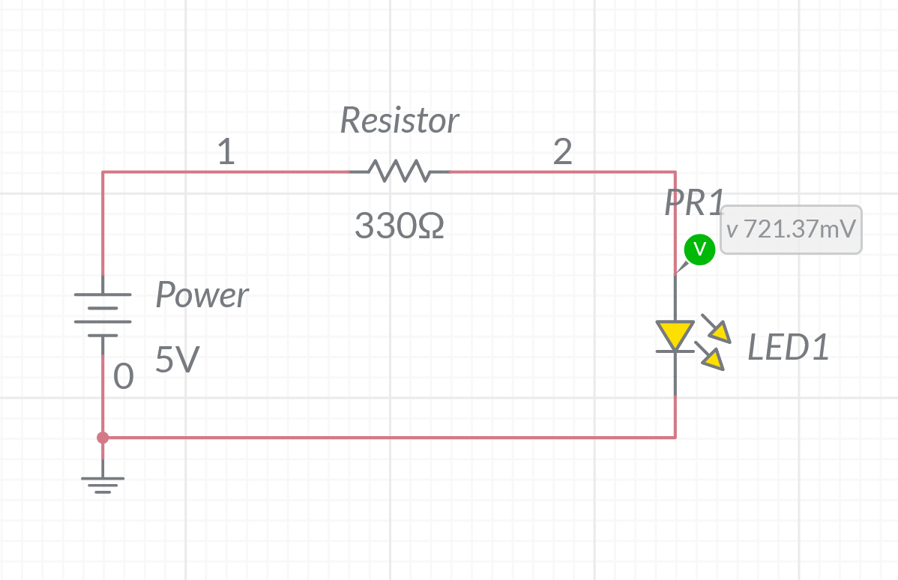
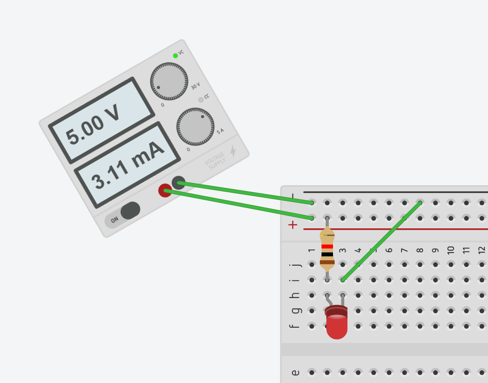
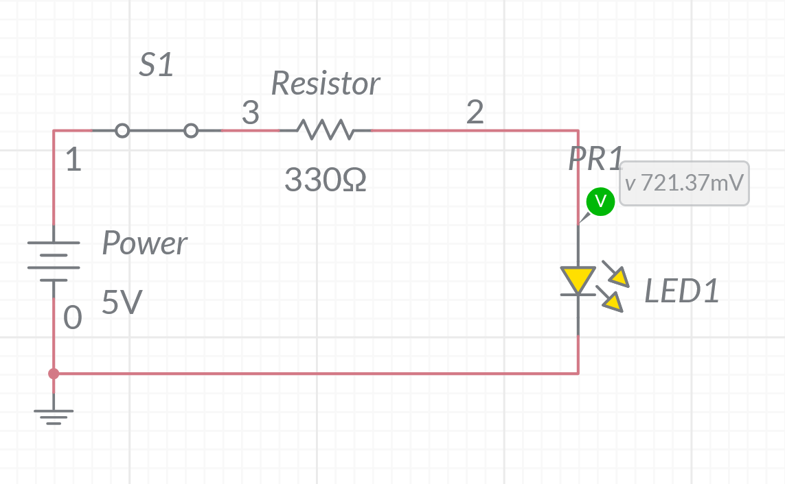
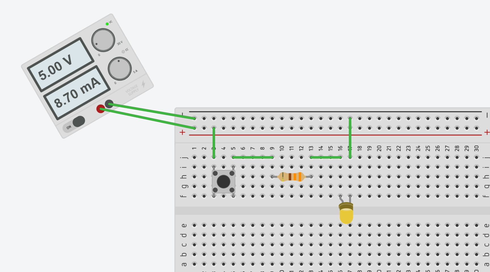
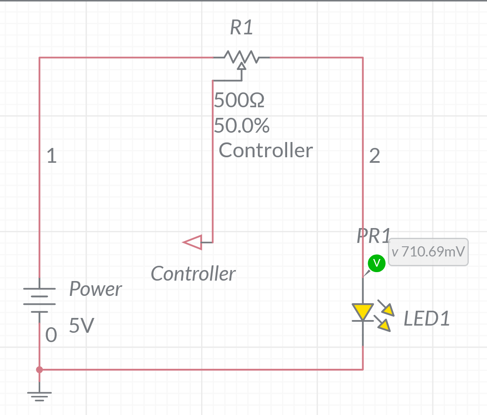
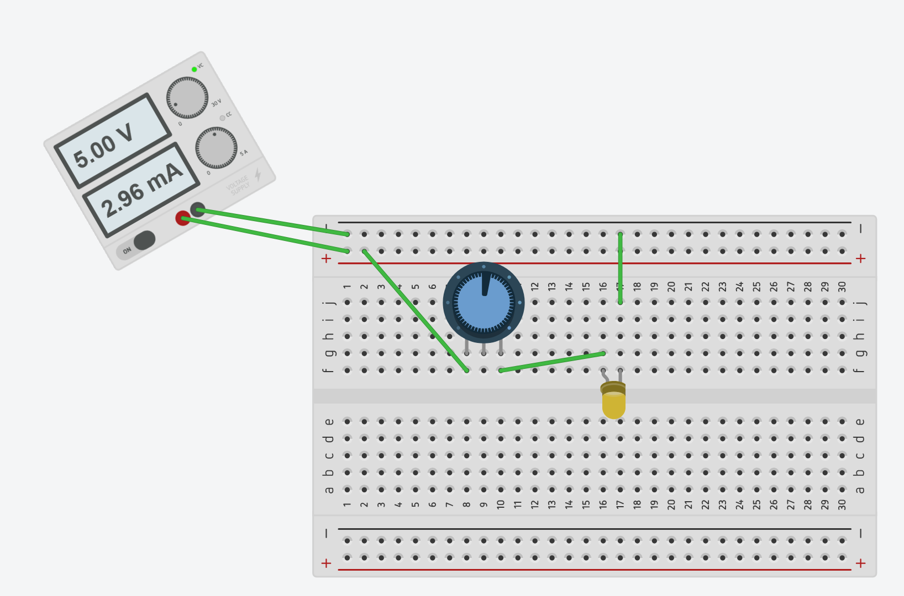

# Introduction to Breadboards  

## Basic Circuits
### 1. LED Circuit!
#### Components Used
1. 330 Ohm Resistor
2. LED
3. 3 Jumper Wires

#### Simulator

#### Breadboard

### 2. Push Button LED!
#### Components Used
1. Push Button
2. LED
3. 330 Ohm Resistor
4. 6 Jumper Wires

#### Simulator

#### Breadboard

### 3. Brightness Control!
#### Components Used
1. Potentiometer
2. LED
3. 5 Jumper Wires

#### Simulator

#### Breadboard

## Advance Circuits
### 4. 15 Volts to 5 Volts!
#### Components Used
1. L7805CV
2. 6 Jumper wires
3. 0.33µF Capacitor
4. 0.1µF Capacitor

#### Breadboard

### 5. 
#### Components Used
1. 

#### Simulator

#### Breadboard

## Sources
- https://www.instructables.com/Lets-Make-5-More-BreadBoard-Projects-for-Begginers/
- chatgpt, "Review this guide for breadboards that should explain concepts lightly with little to no circuit theory"

## Image Credits
- https://www.programmingelectronics.com/how-to-use-a-solderless-breadboard-with-arduino/
- https://os.mbed.com/handbook/Breadboard
